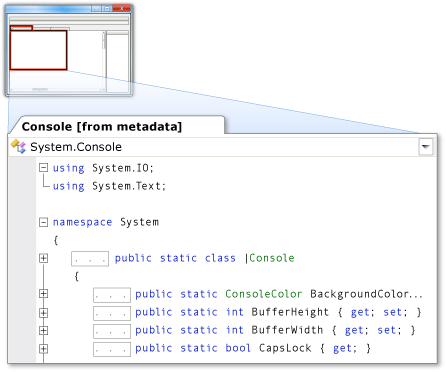

# Metadata as Source
Metadata as source enables you to view metadata that appears as C# source code in a read-only buffer. This enables a view of the declarations of the types and members (without implementations). You can view metadata as source by running the **Go To Definition** command for types or members whose source code is not available from your project or solution.  
  
> [!NOTE]
>  When you try to run the **Go To Definition** command for types or members that are marked as internal, the integrated development environment (IDE) does not display their metadata as source, regardless of whether the referencing assembly is a friend or not.  
  
 You can view metadata as source in either the Code Editor or the **Code Definition** window.  
  
## Viewing Metadata as Source in the Code Editor  
 When you run the **Go To Definition** command for an item whose source code is unavailable, a tabbed document that contains a view of that item's metadata, displayed as source, appears in the Code Editor. The name of the type, followed by **[from metadata]**, appears on the document's tab.  
  
 For example, if you run the **Go To Definition** command for <xref:System.Console>, metadata for <xref:System.Console> appears in the Code Editor as C# source code that resembles its declaration, but without an implementation.  
  
   
  
## Viewing Metadata as Source in the Code Definition Window  
 When the **Code Definition** window is active or visible, the IDE automatically executes the **Go To Definition** command for items under the cursor in the Code Editor and for items that are selected in **Class View** or the **Object Browser**. If the source code is not available for that item, the IDE displays the item's metadata as source in the **Code Definition** window.  
  
 For example, if you put your cursor inside the word <xref:System.Console> in the Code Editor, metadata for <xref:System.Console> appears as source in the **Code Definition** window. The source resembles the <xref:System.Console> declaration, but without an implementation.  
  
 If you want to see the declaration of an item that appears in the **Code Definition** window, right-click the item and click **Go To Definition**.