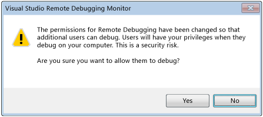

# Debugger Security
The ability to debug another process gives you extremely broad powers that you would not otherwise have, especially when debugging remotely. A malicious debugger could inflict widespread damage on the machine being debugged.  
  
 However, many developers do not realize that the security threat can also flow in the opposite direction. It is possible for malicious code in the debuggee process to jeopardize the security of the debugging machine: there are a number of security exploits that must be guarded against.  
  
## Security Best Practices  
 There is an implicit trust relationship between the code you are debugging, and the debugger. If you are willing to debug something, you should also be willing to run it. The bottom line is that you must be able to trust what you are debugging. If you cannot trust it, then you should not debug it, or you should debug it from a machine that you can afford to jeopardize, and in an isolated environment.  
  
 In order to reduce the potential attack surface, debugging should be disabled on production machines. For the same reason, debugging should never be enabled indefinitely.  
  
### Managed Debugging Security  
 Here are some general recommendations that apply to all managed debugging.  
  
-   Be careful when attaching to an untrusted user’s process: when you do so, you assume that it is trustworthy. When you attempt to attach to an untrusted user's process, a security warning dialog box confirmation will appear asking whether you want to attach to the process. "Trusted users" include you, and a set of standard users commonly defined on machines that have the .NET Framework installed, such as **aspnet**, **localsystem**, **networkservice**, and **localservice**. For more information, see [Security Warning: Attaching to a process owned by an untrusted user can be dangerous. If the following information looks suspicious or you are unsure, do not attach to this process](../debugger/security-warning-attaching-to-a-process-owned-by-an-untrusted-user-can-be-dangerous-if-the-following-information-looks-suspicious-or-you-are-unsure-do-not-attach-to-this-process.md).  
  
-   Be careful when downloading a project off the Internet and loading it into [!INCLUDE[vsprvs](../code-quality/includes/vsprvs_md.md)]. This is very risky to do even without debugging. When you do this, you are assuming that the project and the code that it contains are trustworthy.  
  
 For more information, see [Debugging Managed Code](../debugger/debugging-managed-code.md).  
  
### Remote Debugging Security  
 Local debugging is generally safer than remote debugging. Remote debugging increases the total surface area that can be probed.  
  
 The Visual Studio Remote Debugging Monitor (msvsmon.exe) is used in remote debugging, and there are several security recommendations for configuring it. The preferred way to configure the authentication mode is Windows Authentication, because No Authentication mode is insecure.  
  
   
  
 When using Windows Authentication mode, be aware that granting an untrusted user permission to connect to msvsmon is dangerous, because the user is granted all your permissions on the computer..  
  
 Do not debug an unknown process on a remote machine: there are potential exploits that might affect the machine running the debugger, or that might compromise msvsmon.exe, the Visual Studio Remote Debugging Monitor. If you absolutely must debug an unknown process, try debugging locally, and use a firewall to keep any potential threats localized.  
  
 For more information, see [Remote Debugging](../debugger/remote-debugging.md).  
  
### Web Services Debugging Security  
 It is safer to debug locally, but since you probably do not have [!INCLUDE[vsprvs](../code-quality/includes/vsprvs_md.md)] installed on the web server, local debugging might not be practical. Generally, debugging Web services is done remotely, except during development, so the recommendations for remote debugging security also apply to Web services debugging. Here are some additional best practices. For more information, see [Debugging XML Web Services](http://msdn.microsoft.com/en-us/c900b137-9fbd-4f59-91b5-9c2c6ce06f00).  
  
-   Do not enable debugging on a Web server that has been compromised.  
  
-   Make sure you know the Web server is secure before debugging it. If you are not sure it is secure, do not debug it.  
  
-   Be especially careful if you are debugging a Web service that is exposed on the Internet.  
  
### External Components  
 Be aware of the trust status of external components that your program interacts with, especially if you did not write the code. Also be aware of components that [!INCLUDE[vsprvs](../code-quality/includes/vsprvs_md.md)] or the debugger might use.  
  
### Symbols and Source Code  
 Two [!INCLUDE[vsprvs](../code-quality/includes/vsprvs_md.md)] tools that require thinking about security are the following:  
  
-   Source Server, which provides you with versions of source code from a source code repository. It is useful when you do not have the current version of a program's source code. [Security Warning: Debugger Must Execute Untrusted Command](../debugger/security-warning-debugger-must-execute-untrusted-command.md).  
  
-   Symbol Server, which is used to supply the symbols needed to debug a crash during a system call.  
  
 See [Specify Symbol (.pdb) and Source Files](../debugger/specify-symbol-dot-pdb-and-source-files-in-the-visual-studio-debugger.md)  
  
## See Also  
 [Debugger Settings and Preparation](../debugger/debugger-settings-and-preparation.md)   
 [Debugger Basics](../debugger/debugger-basics.md)   
 [Security Warning: Attaching to a process owned by an untrusted user can be dangerous. If the following information looks suspicious or you are unsure, do not attach to this process](../debugger/security-warning-attaching-to-a-process-owned-by-an-untrusted-user-can-be-dangerous-if-the-following-information-looks-suspicious-or-you-are-unsure-do-not-attach-to-this-process.md)   
 [Security Warning: Debugger Must Execute Untrusted Command](../debugger/security-warning-debugger-must-execute-untrusted-command.md)