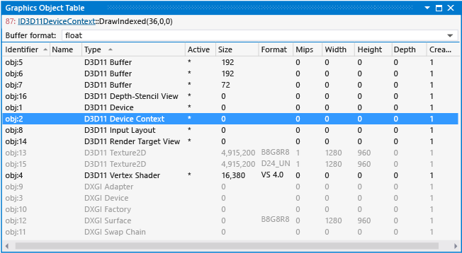
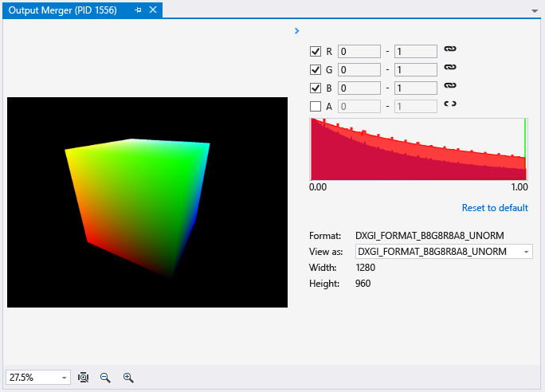

# Graphics Object Table
The Graphics Object Table in Visual Studio Graphics Analysis helps you understand the Direct3D objects that support a frame of your game or app.  
  
 This is the Object Table:  
  
   
  
## Understanding the Graphics Object Table  
 By using the Object Table, you can analyze the Direct3D objects that support the rendering of a particular frame. You can pinpoint a rendering problem to a specific object by examining its properties and data (by using other Graphics Diagnostics tools earlier in your diagnosis, you can narrow the list of objects that might not be what you expect.) When you've found the offending object, you can use a visualization that's specific to its type to examine it—for example, you can use the Image Editor to view textures, or the *Buffer Visualizer* to view buffer contents.  
  
 The Object Table supports copy and paste so that you can use another tool—for example, Microsoft Excel—to examine its contents.  
  
### Graphics Object Table format  
 The Object Table displays the Direct3D objects and resources that support the frame that's associated with the selected event—for example, state objects, buffers, shaders, textures, and other resources. Objects that were created in a previous frame but are not used during the captured frame are omitted from the object table. Objects that have been destroyed by previous events during the captured frame are omitted in subsequent events. Objects that are not set on the D3D10Device or D3D11DeviceContext are displayed as gray text. Objects are displayed in a table format.  
  
|Column|Description|  
|------------|-----------------|  
|**Identifier**|The object ID.|  
|**Name**|Application-specific information that was set on the object by using the Direct3D function `SetPrivateData`—typically to provide additional identifying information about an object.|  
|**Type**|The object type.|  
|**Active**|Displays "*" for an object that was set on the D3D10Device or D3D11DeviceContext during the captured frame.   This corresponds to objects that are displayed as grey text, but provides a column entry that you can use to help sort the object table.|  
|**Size**|The size of the object in bytes.|  
|**Format**|The format of the object. For example, the format of a texture object, or the shader model of a shader object.|  
|**Width**|The width of a texture object. Does not apply to other object types.|  
|**Height**|The height of a texture object. Does not apply to other object types.|  
|**Depth**|The depth of a 3-D texture object. If a texture is not 3-D, then the value is 0. Does not apply to other object types.|  
|**Mips**|The number of MIP levels that a texture object has. Does not apply to other object types.|  
|**ArraySize**|The number of textures in a texture array. The range is from 1 to an upper-bound defined by the current feature level. For a cube-map, this value is 6 times the number of cube-maps in the array.|  
|**Samples**|The number of multisamples per pixel.|  
  
## Graphics object viewers  
 To view details about an object, open it by choosing its name in the Object Table. Details about the object are displayed in different formats, depending on the type of the object. For example, textures are displayed using the texture viewer and device state such as D3D11 Device Context is displayed as a formatted list. Different versions of Direct3D make use of different objects, and there are often specific visualizers for the most important objects of each version.  
  
 Here's the texture viewer showing the contents of the Output Merger pipeline stage.  
  
   
  
### D3D12 Command List  
 In Direct3D 12 a command list is an object that records commands into a command allocator so that they can be submitted to the GPU as a single request. Command lists usually perform a series of state-setting, draw, clear and copy commands. They're particularly important because they're the preferred method of rendering in Direct3D 12, and can be re-used between frames to help increase performance. Command List details are displayed in a new document window, with information related to each pipeline stage presented on its own tab.  
  
### D3D12 Pipeline State Object (PSO)  
 In Direct3D 12 a pipeline state object represents a significant portion of the GPU state, including all currently set shaders and certain fixed-function state objects. Once created, a pipeline state object is immutable—an application can only change the configuration of the pipeline by binding a different pipeline state object. PSO details are displayed in a new document window, with details of the pipeline configuration laid out hierarchically.  
  
### D3D12 Root Signature  
 In Direct3D 12, the root signature defines all the resources that are bound to a graphics or compute pipeline, and it links command lists to the resources that the shaders requires. Typically there's one root signature for graphics and one for compute in an app. Root signature details are displayed in a new document window, with details of the root signature laid out hierarchically.  
  
### D3D12 Resources  
 In Direct3D 12, resources are catch-all objects that provide data to the rendering pipeline; this is in contrast to Direct3D11 which defined many specific objects for different kinds and dimensions of resources. A Direct3D 12 resource can contain texture data, vertex data, shader data, and more—they can even represent render targets such as the depth buffer. Details of a Direct3D 12 resource are displayed in a new document window; Graphics Analysis will use the appropriate viewer for the contents of the resource object if it's able to determine its type. For example, a resource object that contains texture data is displayed using the texture viewer, just like a D3D11 Texture2D object is.  
  
### Device context object  
 In Direct3D 11 and Direct3D 10, the device context (**D3D11 Device Context** or **D3D10 Device**) object is particularly important because it holds the most important state information, and it links to other state objects that are currently set. Device context details are displayed in a new document window, and each category of information is presented there on its own tab. The device context changes when a new event is selected to reflect the current device state.  
  
### Buffer object  
 Buffer object details (D3D11 Buffer or D3D10 Buffer) are displayed in a new document window that presents the buffer contents in a table and provides an interface for changing how the buffer contents are displayed. The **buffer data** table supports copy and paste so that you can use another tool—for example, Microsoft Excel—to examine its contents. The content of the buffer is interpreted according to the value of the **format** combo box, which is located above the **buffer data** table. In the box, you can enter a composite data format that's made up of the data types that are listed in the following table. For example, "float int" displays a list of structures that contain a 32-bit floating-point value followed by a 32-bit signed integer value. Composite data formats that you have specified are added to the combo box for later use.  
  
 You can also toggle the **Show Offsets** checkbox to hide or display the offset of each element in the buffer.  
  
|Type|Description|  
|----------|-----------------|  
|**float**|A 32-bit floating-point value.|  
|**float2**|A vector that contains two 32-bit floating-point values.|  
|**float3**|A vector that contains three 32-bit floating-point values.|  
|**float4**|A vector that contains four 32-bit floating-point values.|  
|**byte**|An 8-bit signed integer value.|  
|**2byte**|A 16-bit signed integer value.|  
|**4byte**|A 32-bit signed integer value. Same as **int**.|  
|**8byte**|A 64-bit signed integer value. Same as **int64**.|  
|**xbyte**|An 8-bit hexadecimal value.|  
|**x2byte**|A 16-bit hexadecimal value.|  
|**x4byte**|A 32-bit hexadecimal value. Same as **xint**.|  
|**x8byte**|A 64-bit hexadecimal value. Same as **xint64**.|  
|**ubyte**|An 8-bit unsigned integer value.|  
|**u2byte**|A 16-bit unsigned integer value.|  
|**u4byte**|A 32-bit unsigned integer value. Same as **uint**.|  
|**u8byte**|A 64-bit unsigned integer value. Same as **uint64**.|  
|**half**|A 16-bit floating-point value.|  
|**half2**|A vector that contains two 16-bit floating-point values.|  
|**half3**|A vector that contains three 16-bit floating-point values.|  
|**half4**|A vector that contains four 16-bit floating-point values.|  
|**double**|A 64-bit floating-point value.|  
|**int**|A 32-bit signed integer value. Same as **4byte**.|  
|**int64**|A 64-bit signed integer value. Same as **8byte**.|  
|**xint**|A 32-bit hexadecimal value. Same as **x4byte**.|  
|**xint64**|A 64-bit hexadecimal value. Same as **x8byte**.|  
|**uint**|A 32-bit unsigned integer value. Same as **u4byte**.|  
|**uint64**|A 64-bit unsigned integer value. Same as **u8byte**.|  
|**bool**|A Boolean (`true` or `false`) value. Each Boolean value is represented by a 32-bit value.|  
  
## See Also  
 [Graphics Diagnostics (Debugging DirectX Graphics)](../debugger/visual-studio-graphics-diagnostics.md)   
 [Walkthrough: Missing Objects Due to Device State](../debugger/walkthrough-missing-objects-due-to-device-state.md)