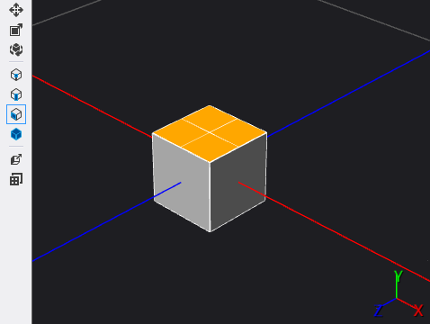
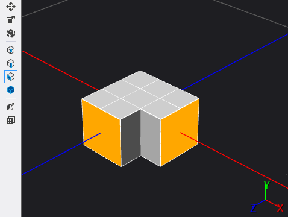
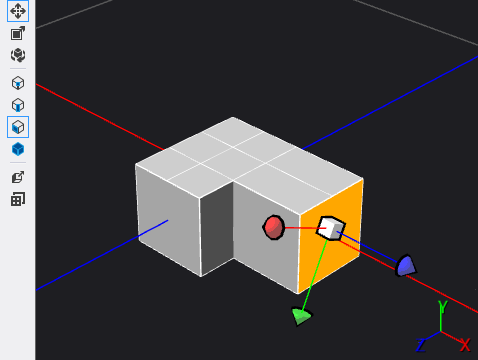
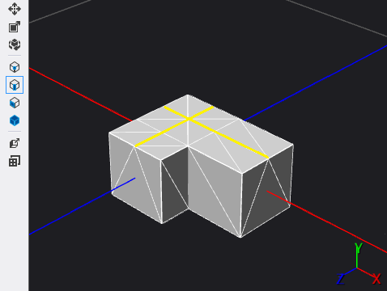

# How to: Create a Basic 3-D Model
This document demonstrates how to use the Model Editor to create a basic 3-D model.  
  
 This document demonstrates these activities:  
  
-   Adding objects to a scene  
  
-   Selecting faces and edges  
  
-   Translating selections  
  
-   Using the **Subdivide face** and **Extrude face** tools  
  
-   Using the **Triangulate** command  
  
## Creating a basic 3-D model  
 You can use the Model Editor to create and modify 3-D models and scenes for your game or app. The following steps show how to use the Model Editor to create a simplified 3-D model of a house. A simplified model can be used as a stand-in for final art assets that are still being created, as a mesh for collision detection, or as a low-detail model to be used when the object that it represents is too far away to benefit from more detailed rendering.  
  
 When you're finished, the model should look like this:  
  
   
  
 Before you begin, make sure that the **Properties** window and **Toolbox** are displayed.  
  
#### To create a simplified 3-D model of a house  
  
1.  Create a 3-D model to work with. For information about how to add a model to your project, see the Getting Started section in [Model Editor](../designers/model-editor.md).  
  
2.  Add a cube to the scene. In the **Toolbox** window, under **Shapes**, select **Cube** and then move it to the design surface.  
  
3.  Switch to face-selection. On the Model Editor toolbar, choose **Select Face**.  
  
4.  Subdivide the top of the cube. In face selection mode, choose the cube once to activate it for selection, and then choose the top of the cube to select the top face. On the Model Editor toolbar, choose **Subdivide face**. This adds new vertices to the top of the cube that split it into four equally sized partitions.  
  
       
  
5.  Extrude two adjacent sides of the cube—for example, the front and right sides of the cube. In face selection mode, choose the cube once to activate it for selection and then choose one side of the cube. Press and hold the Control key, choose another side of the cube that is adjacent to the side you selected first, and then on the Model Editor toolbar, choose **Extrude face**.  
  
       
  
6.  Extend one of the extrusions. Choose one of the faces that you just extruded, and then, on the Model Editor toolbar, choose the **Translate** tool and move the translation manipulator in the same direction as the extrusion.  
  
       
  
7.  Triangulate the model. On the Model Editor toolbar, choose **Advanced**, **Tools**, **Triangulate**.  
  
8.  Create the roof of the house. Switch to edge-selection mode by choosing **Select Edge** on the Model Editor toolbar, and then choose the cube to activate it. Press and hold the Control key as you select the edges that are shown here:  
  
       
  
     When the edges are selected, on the Model Editor toolbar, choose the **Translate** tool and then move the translation manipulator upward to create the roof of the house.  
  
 The simplified house model is complete. Here's the final model again, with flat shading applied:  
  
   
  
 As a next step, you can apply a shader to this 3-D model. For information, see [How to: Apply a Shader to a 3-D Model](../designers/how-to-apply-a-shader-to-a-3-d-model.md).  
  
## See Also  
 [How to: Model 3-D Terrain](../designers/how-to-model-3-d-terrain.md)   
 [Model Editor](../designers/model-editor.md)   
 [Shader Designer](../designers/shader-designer.md)