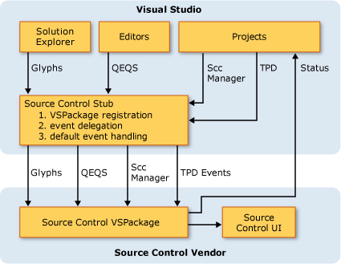

# Source Control VSPackage Architecture
A source-control package is a VSPackage that uses services that the [!INCLUDE[vsprvs](../../code-quality/includes/vsprvs_md.md)] IDE provides. In return, a source-control package provides its functionality as a source control service. Additionally, a source-control package is a more versatile alternative than a source control plug-in for integrating source control into [!INCLUDE[vsprvs](../../code-quality/includes/vsprvs_md.md)].  
  
 A source control plug-in that implements the Source Control Plug-in API abides by a strict contract. For example, a plug-in cannot replace the default [!INCLUDE[vsprvs](../../code-quality/includes/vsprvs_md.md)] user interface (UI). Moreover, the Source Control Plug-in API does not enable a plug-in to implement its own source control model. A source-control package, however, overcomes both of these limitations. A source-control package has complete control over the source control experience of a [!INCLUDE[vsprvs](../../code-quality/includes/vsprvs_md.md)] user. Additionally, a source-control package can use its own source control model and logic, and it can define all the source control-related user interfaces.  
  
## Source-Control Package Components  
 As shown in the architecture diagram, a [!INCLUDE[vsprvs](../../code-quality/includes/vsprvs_md.md)] component named the Source Control Stub is a VSPackage that integrates a source-control package with [!INCLUDE[vsprvs](../../code-quality/includes/vsprvs_md.md)].  
  
 Source Control Stub handles the following tasks.  
  
-   Provides the common UI that is required for source-control package registration.  
  
-   Loads a source-control package.  
  
-   Sets a source-control package as active/inactive.  
  
 Source Control Stub looks for the active service for the source-control package and routes all incoming service calls from the IDE to that package.  
  
 The Source Control Adapter Package is a special source-control package that [!INCLUDE[vsprvs](../../code-quality/includes/vsprvs_md.md)] provides. This package is the central component for supporting source control plug-ins based on the Source Control Plug-in API. When a source control plug-in is the active plug-in, the Source Control Stub sends its events to the Source Control Adapter Package. In turn, the Source Control Adapter Package communicates with the source control plug-in by using the Source Control Plug-in API and also provides a default UI that is common for all source control plug-ins.  
  
 When a source-control package is the active package, on the other hand, the Source Control Stub directly communicates with the package by using the [!INCLUDE[vsipsdk](../../extensibility/includes/vsipsdk_md.md)] Source-Control Package interfaces. The source-control package is responsible for hosting its own source control UI.  
  
   
  
 For a source-control package, [!INCLUDE[vsprvs](../../code-quality/includes/vsprvs_md.md)] does not supply source control code or an API for integration. Contrast this with the approach outlined in [Creating a Source Control Plug-in](../../extensibility/internals/creating-a-source-control-plug-in.md) where the source control plug-in has to implement a rigid set of functions and callbacks.  
  
 Like any VSPackage, a source-control package is a COM object that can be created by using `CoCreateInstance`. The VSPackage makes itself available to the [!INCLUDE[vsprvs](../../code-quality/includes/vsprvs_md.md)] IDE by implementing <xref:Microsoft.VisualStudio.Shell.Interop.IVsPackage>. When an instance has been created, a VSPackage receives a site pointer and an <xref:Microsoft.VisualStudio.OLE.Interop.IServiceProvider> interface that provides the VSPackage access to the available services and interfaces in the IDE.  
  
 Writing a VSPackage-based source-control package requires more advanced programming expertise than writing a Source Control Plug-in API-based plug-in.  
  
## See Also  
 <xref:Microsoft.VisualStudio.Shell.Interop.IVsPackage>   
 [Getting Started](../../extensibility/internals/getting-started-with-source-control-vspackages.md)