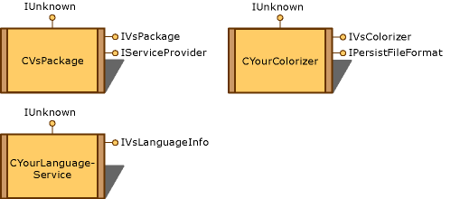

# Syntax Coloring in a Legacy Language Service
[!INCLUDE[vsprvs](../../code-quality/includes/vsprvs_md.md)] uses a coloring service to identify elements of the language and display them with the specified colors in an editor.  
  
## Colorizer Model  
 The language service implements the <xref:Microsoft.VisualStudio.TextManager.Interop.IVsColorizer> interface, which is then used by editors. This implementation is a separate object from the language service, as shown in the following illustration.  
  
   
Simple colorizer model  
  
> [!NOTE]
>  The syntax coloring service is separate from the general [!INCLUDE[vsprvs](../../code-quality/includes/vsprvs_md.md)] mechanism for colorizing text. For more information about the general [!INCLUDE[vsipsdk](../../extensibility/includes/vsipsdk_md.md)] mechanism supporting colorizing, see [Using Fonts and Colors](../../extensibility/using-fonts-and-colors.md).  
  
 Besides the colorizer, the language service can supply custom colorable items that are used by the editor by advertising that it supplies custom colorable items. You can do this by implementing the <xref:Microsoft.VisualStudio.TextManager.Interop.IVsProvideColorableItems> interface on the same object that implements the <xref:Microsoft.VisualStudio.TextManager.Interop.IVsLanguageInfo> interface. It returns the number of custom colorable items when the editor calls the <xref:Microsoft.VisualStudio.TextManager.Interop.IVsProvideColorableItems.GetItemCount*> method, and it returns an individual custom colorable item when the editor calls the <xref:Microsoft.VisualStudio.TextManager.Interop.IVsProvideColorableItems.GetColorableItem*> method.  
  
 The <xref:Microsoft.VisualStudio.TextManager.Interop.IVsProvideColorableItems.GetColorableItem*> method returns an object that implements the <xref:Microsoft.VisualStudio.TextManager.Interop.IVsColorableItem> interface. If the language service supports 24-bit or high color values, it must implement the <xref:Microsoft.VisualStudio.TextManager.Interop.IVsHiColorItem> interface on the same object as the <xref:Microsoft.VisualStudio.TextManager.Interop.IVsColorableItem> interface.  
  
## How a VSPackage Uses a Language Service Colorizer  
  
1.  The VSPackage must get the appropriate language service, which requires the language service VSPackage to do the following:  
  
    1.  Use an object implementing the <xref:Microsoft.VisualStudio.TextManager.Interop.IVsTextBuffer> interface to get the text to be colorized.  
  
         Text is typically displayed using an object that implements the <xref:Microsoft.VisualStudio.TextManager.Interop.IVsTextView> interface.  
  
    2.  Get the language service by querying the service provider of the VSPackage for the language service GUID. Language services are identified in the registry by file extension.  
  
    3.  Associate the language service with the <xref:Microsoft.VisualStudio.TextManager.Interop.IVsTextBuffer> by calling its <xref:Microsoft.VisualStudio.TextManager.Interop.IVsTextBuffer.SetLanguageServiceID*> method.  
  
2.  The VSPackage can now obtain and use the colorizer object as follows:  
  
    > [!NOTE]
    >  VSPackages that use the core editor do not have to obtain a language service's colorizer objects explicitly. As soon as an instance of the core editor obtains an appropriate language service, it performs all the colorization tasks shown here.  
  
    1.  Obtain the language service's colorizer object, which implements the `T:Microsoft.VisualStudio.TextManager.Interop.IVsColorizer`, and <xref:Microsoft.VisualStudio.TextManager.Interop.IVsColorizer2> interfaces, by calling the <xref:Microsoft.VisualStudio.TextManager.Interop.IVsLanguageInfo.GetColorizer*> method on the language service's <xref:Microsoft.VisualStudio.TextManager.Interop.IVsLanguageInfo> object.  
  
    2.  Call the <xref:Microsoft.VisualStudio.TextManager.Interop.IVsColorizer.ColorizeLine*> method to obtain the colorizer information for a particular span of text.  
  
         <xref:Microsoft.VisualStudio.TextManager.Interop.IVsColorizer.ColorizeLine*> returns an array of values, one for each character in the text span being colorized. The values are indexes into a colorable item list that is either the default colorable item list maintained by the core editor or a custom colorable item list maintained by the language service itself.  
  
    3.  Use the colorization information returned by the <xref:Microsoft.VisualStudio.TextManager.Interop.IVsColorizer.ColorizeLine*> method to display the selected text.  
  
> [!NOTE]
>  In addition to using a language service colorizer, a VSPackage can also use the general-purpose [!INCLUDE[vsprvs](../../code-quality/includes/vsprvs_md.md)] text coloring mechanism. For more information about this mechanism, see [Using Fonts and Colors](../../extensibility/using-fonts-and-colors.md).  
  
## In This Section  
 [Implementing Syntax Coloring](../../extensibility/internals/implementing-syntax-coloring.md)  
 Discusses how an editor accesses a language service's syntax coloring and what the language service must implement to support syntax coloring.  
  
 [How to: Use Built-In Colorable Items](../../extensibility/internals/how-to-use-built-in-colorable-items.md)  
 Demonstrates how to use built-in colorable items from the language service.  
  
 [Custom Colorable Items](../../extensibility/internals/custom-colorable-items.md)  
 Discusses how to implement custom colorable items.  
  
## See Also  
 [Using Fonts and Colors](../../extensibility/using-fonts-and-colors.md)