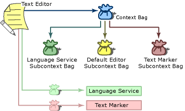

# Providing a Language Service Context by Using the Legacy API
There are two options for a language service to provide user context using the [!INCLUDE[vsprvs](../codequality/includes/vsprvs_md.md)] core editor: provide text marker context, or provide all user context. The differences between each are outlined here.  
  
 For more information on providing context to a language service that is connected to your own editor, see [How to: Provide Context for Editors](../extensibility/how-to--provide-context-for-editors.md).  
  
## Provide Text Marker Context to the Editor  
 To provide context for compiler errors indicated by text markers in the [!INCLUDE[vsprvs](../codequality/includes/vsprvs_md.md)] core editor, implement the \<xref:Microsoft.VisualStudio.TextManager.Interop.IVsTextMarkerContextProvider> interface. In this scenario, the language service provides context only when the cursor is on a text marker. This allows the editor to provide the keyword at the cursor to the **Dynamic Help** window with no attributes.  
  
## Provide All User Context to the Editor  
 If you are creating a language service and are using the [!INCLUDE[vsprvs](../codequality/includes/vsprvs_md.md)] core editor, then you can implement the \<xref:Microsoft.VisualStudio.TextManager.Interop.IVsLanguageContextProvider> interface to provide context for your language service.  
  
 For the implementation of `IVsLanguageContextProvider`, a context bag (collection) is attached to the editor, which is responsible for updating the context bag. When the **Dynamic Help** window calls the \<xref:Microsoft.VisualStudio.Shell.Interop.IVsUserContext.Update*> interface on this context bag at idle time, the context bag queries the editor for an update. The editor then notifies the language service that it should update the editor, and passes a pointer to the context bag. This is done by calling the \<xref:Microsoft.VisualStudio.TextManager.Interop.IVsLanguageContextProvider.UpdateLanguageContext*> method from the editor to the language service. Using the pointer to the context bag, the language service can now add and remove attributes and keywords. For more information, see \<xref:Microsoft.VisualStudio.TextManager.Interop.IVsLanguageContextProvider>.  
  
 There are two different ways to implement `IVsLanguageContextProvider`:  
  
-   Provide a keyword to the context bag  
  
     When the editor is called to update the context bag, pass in the appropriate keywords and attributes and then return `S_OK`. This return value instructs the editor to retain your keyword and attribute context rather than provide the keyword at the cursor to the context bag.  
  
-   Obtain the keyword from the keyword at the cursor  
  
     When the editor is called to update the context bag, pass in the appropriate attributes and then return `E_FAIL`. This return value instructs the editor to retain your attributes in the context bag, but update the context bag with the keyword at the cursor.  
  
 The following diagram demonstrates how context is provided for a language service that implements `IVsLanguageContextProvider`.  
  
   
Context for a language service  
  
 As you can see in the diagram, the [!INCLUDE[vsprvs](../codequality/includes/vsprvs_md.md)] core text editor has a context bag attached to it. This context bag points to three separate subcontext bags: language service, default editor, and text marker. The language service and text marker subcontext bags contain attributes and keywords for the language service if the \<xref:Microsoft.VisualStudio.TextManager.Interop.IVsLanguageContextProvider> interface is implemented, and text markers if the \<xref:Microsoft.VisualStudio.TextManager.Interop.IVsTextMarkerContextProvider> interface is implemented. If you do not implement either of these interfaces, then the editor provides context for the keyword at the cursor in the default editor subcontext bag.  
  
## Context Guidelines for Editors and Designers  
 Designers and editors must supply a general keyword for the editor or designer window. This is done so that a generic, but appropriate, Help topic will display for the designer or editor when a user presses F1. An editor must, in addition to this, supply the current keyword at the cursor or supply a key term based on the current selection. This is done to ensure that a Help topic for the text or UI element pointed to or selected displays when the user presses F1. A designer supplies context for an item selected in a designer, such as a button on a form. Editors and designers must also connect to a language service as outlined in [Legacy Language Service Essentials](../extensibility/legacy-language-service-essentials.md).