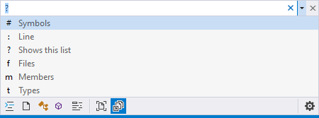

# Go To...
There are many ways to easily navigate your code inside of the Visual Studio IDE, but from the keyboard and the mouse.

## Go To All
This feature lets you navigate through your code to find the specific bits you are looking for.  You can search for a specific line, type, symbol, file, and more from a simple interface.

### How to use
* **Keyboard**
  * Press **Ctrl+,** or **Ctrl+T**.  (Note that your keyboard shortcut may be different based on which profile you've selected.)
* **Mouse**
  * Select **Edit > Go To > Go To All**.

This will display a small window at the top right of your IDE, by default.

From here, there are several ways to proceed:
* Enter text without a prefix to search using the [filter icons](#filtered-searches) selected below the text box.
* Enter a [prefix](#filtered-searches) followed by the text to search.
* Enter a question mark (?) to get additional help.
  

### Filtered Searches
To narrow your search to a specific type, you can either use a prefix when typing, or use the icons below the search window as shown below.

Prefix | Icon | Shortcut | Description
:----: | ---- | -------- | ---
#      |  | Ctrl+1, Ctrl+S | Find matching symbols
f      |      | Ctrl+1, Ctrl+F | Find matching file names
m      |  | Ctrl+1, Ctrl+M | Find matching members
t      |      | Ctrl+1, Ctrl+T | Find matching types
:      |      | Ctrl+G         | Go to the line number entered

### Search Locations
To narrow your search to specific locations, use the two document icons.

Icon | Description
---- | ---
 | Search current document only
 | Search external documents in addition to those located in the project/solution

### Settings
Clicking the gear icon  at the lower-right lets you change how this feature works.

Setting | Description
------- | ---
Use preview tab | Display the selected item immediately in the IDE's preview tab
Show details    | Display project, file, line and summary information from documentation comments in the window
Center window   | Move this window to the center of the IDE instead of the top-right

## Go To Definition
To navigate to the definition of a type and open the result in a new tab:

Input        | Function 
------------ | ---
**Keyboard** | Place your text cursor somewhere inside the type name, and press **F12**
**Mouse**    | Right-click on the type name and select **Go To Definition**

## Peek Definition
To preview the the definition of a type in a popup window instead of a new tab:

Input        | Function 
------------ | ---
**Keyboard** | Place your text cursor somewhere inside the type name, and press **Alt+F12**
**Mouse**    | Right-click on the type name and select **Peek Definition**

If you peek another definition from the popup window, you will start a breadcrumb path which you can navigate using the circles and arrows which appear above the popup.

## Go To Implementation
To navigate to the implementation of a type:

Input        | Function 
------------ | ---
**Keyboard** | Place your text cursor somewhere inside the type name, and press **Ctrl+F12**
**Mouse**    | Right-click on the type name and select **Go To Implementation**

## Navigate Back
When using any of the navigation features of Visual Studio, you can always immediately jump back to your previous position using the **Ctrl+-** keyboard shortcut, or the **View > Navigate Backward** menu item.
