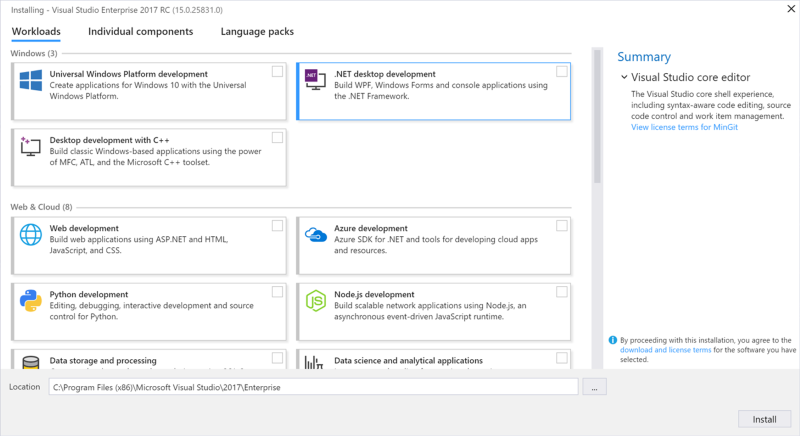

# Install Visual Studio 2017 RC
Welcome to a new way to install Visual Studio! In our newest version, we’ve made it easier for you to select and install just the features you need—and we’ve reduced the minimum footprint of Visual Studio so that it installs more quickly and with less system impact than ever before.  

 Want to know more about what else is new in RC? See our [release notes](https://www.visualstudio.com/news/releasenotes/vs15-relnotes). And for more in-depth info about how we’ve redesigned the installation experience, see our blog posts, “[Faster and leaner Visual Studio installer](https://blogs.msdn.microsoft.com/visualstudio/2016/04/01/faster-leaner-visual-studio-installer/)” and “[Anatomy of a low-impact Visual Studio installation](https://blogs.msdn.microsoft.com/visualstudio/2016/04/25/anatomy-of-a-low-impact-visual-studio-install/).”  

 Ready to install? Let's get started!  

## Install the installer  
 When you [download Visual Studio](https://www.visualstudio.com/downloads/visual-studio-next-downloads-vs), you'll get a bootstrapper file that in turn installs our new lightweight installer. This new installer includes everything you need to customize your installation.  

> [!IMPORTANT]
> If you have a Preview release of Visual Studio 2017 installed on your computer, you will be prompted to remove it prior to installing Visual Studio 2017 RC.

1.  [Download Visual Studio Enterprise 2017 RC](https://aka.ms/vs/15/preview/vs_enterprise) and click **Save File**.  Then, from your **Downloads** folder, run the `vs_Enterprise.exe` file.  

     If you receive a User Account Control notice, click **Yes**.  

2.  We’ll ask you to acknowledge the Microsoft [License Terms](https://www.visualstudio.com/support/legal/mt591984) and the Microsoft [Privacy Statement](https://www.visualstudio.com/dn948229). Click **Install** to continue.  

       

3.  You’ll see several status screens that show the progress of the installation. After the installer is finished installing, it’s time to pick the feature sets—or workloads—that you want.

## Install workloads  
 Now, you can customize your installation by using workloads. Select one or more of the workloads you want; each workload contains the features you need for the programming language or platform you prefer.  

 Here’s how to get them.  

1.  Find the workload you want in the **Installing Visual Studio** screen.  

    

     For example, choose the .NET Desktop development workload. It comes with the default core editor, which includes basic code editing support for over 20 languages, the ability to open and edit code from any folder without requiring a project, and integrated source code control.  

2.  After you select the workload(s) you want, click **Install**.  

    Next, status screens will appear that show the progress of your Visual Studio installation.

3. If you are asked to reboot your computer, do so, and then find and restart the **Microsoft Visual Studio Installer** program.  

4.    After everything’s installed, you can click either **Modify** to change your workloads, or click **Launch** to start Visual Studio.  

## Install individual components

If you don’t want to use the handy Workloads feature to customize your Visual Studio installation, click the **Individual Components** option from the Visual Studio Installer, select what you want, and then follow the prompts.

## Install Language packs

To install Visual Studio 2017 RC in a language of your choosing, click the **Language packs** option from the Visual Studio Installer, and follow the prompts.

## See Also  
* [Modify Visual Studio 2017 RC](../install/modify-visual-studio.md)
* * [Uninstall Visual Studio 2017 RC](../install/uninstall-visual-studio.md)
* [How to Report a Problem with Visual Studio 2017](../ide/how-to-report-a-problem-with-visual-studio-2017.md)
