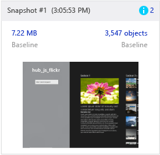
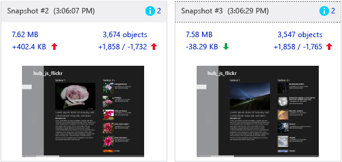
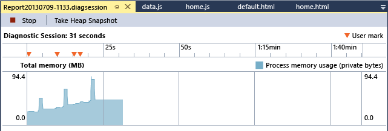
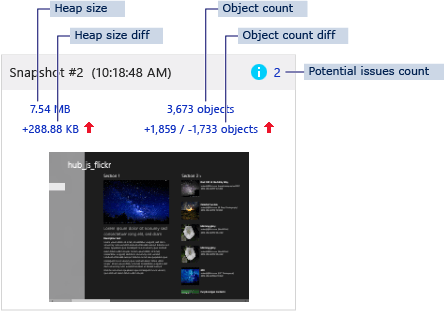
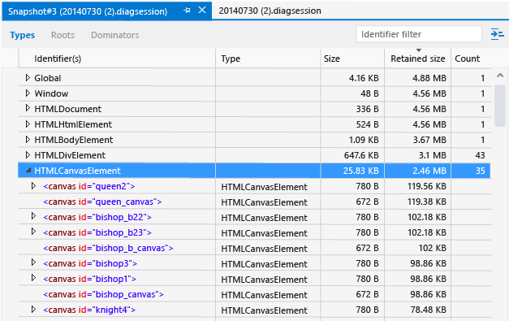

# JavaScript Memory
The JavaScript memory analyzer is available in Visual Studio to help you understand memory usage and find memory leaks in your Store apps built for Windows using JavaScript. Supported apps include apps for Windows Phone Store and Windows Store.  
  
 The JavaScript memory analyzer can do these things for you:  
  
-   Help you quickly find memory usage issues in your app by emphasizing the most relevant data.  
  
     You get this data in snapshot summaries that show the differences between two snapshots and provide links to more detailed views.  
  
-   Provide views of dominators, types, and roots to help isolate issues.  
  
-   Reduce non-actionable info in the JavaScript heap data.  
  
     Objects that aren't created directly in your app code are automatically filtered out. You can also filter data by object name.  
  
 For a tutorial that leads you through the process of identifying a memory leak in a working app, see [Walkthrough: Find a memory leak (JavaScript)](../profiling/walkthrough-find-a-memory-leak-javascript.md).  
  
 In this topic:  
  
 [Run the JavaScript memory analyzer](#Run)   
 [Check memory usage](#Check)   
 [Isolate a memory leak](#Isolate)   
 [View live memory usage summary](#LiveMemory)   
 [View a snapshot summary](#SnapshotSummary)   
 [View snapshot details](#SnapshotDetails)   
 [View a snapshot diff](#SnapshotDiff)   
 [View objects by dominator](#FoldObjects)   
 [Filter data by identifier](#Filter)   
 [Find an object in the object tree](#ShowInRootsView)   
 [View shared object references](#References)   
 [Show built-in objects](#BuiltInValues)   
 [Save diagnostic session files](#Save)   
 [Associate source code with memory usage data](#JSConsoleCommands)   
 [Tips for identifying memory issues](#Tips)  
  
##  <a name="Run"></a> Run the JavaScript memory analyzer  
 You can use the memory analyzer when you have a working Windows Store app open in Visual Studio or installed on a computer that is running [!INCLUDE[win8](../debugger/includes/win8_md.md)] or later.  
  
#### To run the memory analyzer  
  
1.  Open Visual Studio.  
  
2.  If you're running the app from Visual Studio, in the **Start Debugging** list on the **Standard** toolbar, choose the debug target for your project: either a Windows Phone Emulator or, for a Windows Store app, **Local Machine**, **Simulator**, or **Remote Machine**.  
  
     For more info about these options, see [Run apps from Visual Studio](../debugger/run-store-apps-from-visual-studio.md).  
  
3.  On the menu bar, choose **Debug**, **Performance Profiler...**.  
  
     By default, the current startup project is analyzed. If you want to change the analysis target, choose **Change Target**.  
  
       
  
     The following options are available for the analysis target:  
  
    -   **Startup Project**. Analyzes the current startup project. If you're running the app on a remote machine, you must choose this option, which is the default.  
  
    -   **Running App**. Lets you select a Windows Store app from a list of running apps. You can't use this option when you're running your app on a remote machine.  
  
         Use this option to analyze memory usage of apps that are running on your computer when you don't have access to source code.  
  
    -   **Installed App**. Lets you select an installed Windows Store app that you want to analyze. You can't use this option when you're running your app on a remote machine.  
  
         Use this option to analyze the memory usage of apps that you have installed on your computer when you don't have access to source code. This option can also be useful when you just want to analyze the memory usage of any app outside your own app development.  
  
4.  From **Available Tools**, select the **JavaScript Memory** check box, and then choose **Start**.  
  
5.  When you start the memory analyzer, a User Account Control window might request your permission to run Visual Studio ETW Collector.exe. Choose **Yes**.  
  
     Interact with the app to test the relevant memory usage scenarios and view the memory graph, as discussed in the following sections.  
  
6.  Switch to Visual Studio by pressing Alt+Tab.  
  
7.  To view data that the memory analyzer is gathering, choose **Take Heap Snapshot**. See [View a snapshot summary](#SnapshotSummary) later in this topic.  
  
##  <a name="Check"></a> Check memory usage  
 You can try to identify memory leaks by using different views in the JavaScript memory analyzer. If you already suspect that your app is leaking memory, see [Isolate a memory leak](#Isolate) for a suggested workflow.  
  
 Use the following views to help identify memory leaks in an app:  
  
-   [View live memory usage summary](#LiveMemory). Use the memory usage graph to look for sudden increases in memory usage or continually increasing memory usage that results from particular actions. Use the live memory usage summary view to take snapshots of the heap. The snapshots appear as a collection under the memory usage graph.  
  
    > [!TIP]
    >  You will see a spike in memory usage when you take a snapshot. Use the snapshot summaries for a more accurate indication of growth.  
  
-   [View a snapshot summary](#SnapshotSummary). You can view snapshot summary info during or after a memory profiling session. Use the snapshot summaries to link to snapshot details and snapshot diff views.  
  
    > [!TIP]
    >  Typically, the snapshot diff views will provide the most useful information about memory leaks.  
  
-   [View snapshot details](#SnapshotDetails). Shows detailed memory usage data for a single snapshot.  
  
-   [View a snapshot diff](#SnapshotDiff). Shows differential values between snapshots. These views show differences in object size and object counts.  
  
##  <a name="Isolate"></a> Isolate a memory leak  
 These steps provide a workflow that might help you use the JavaScript memory analyzer more effectively. These steps can be useful if you suspect that your app has a memory leak. For a tutorial that leads you through the process of identifying a memory leak in a working app, see [Walkthrough: Find a memory leak (JavaScript)](../profiling/walkthrough-find-a-memory-leak-javascript.md).  
  
1.  Open your app in Visual Studio.  
  
2.  Run the JavaScript Memory Analyzer. For more info, see [Run the JavaScript memory analyzer](#Run).  
  
3.  Run your app through the scenario that you want to test. For example, the scenario might involve a large DOM mutation, when a particular page loads, or when the app starts.  
  
4.  Repeat the scenario 1-4 additional times.  
  
    > [!TIP]
    >  By repeating the test scenario several times, you can help make sure that initialization work can be filtered out of the results.  
  
5.  Switch to Visual Studio (press Alt+Tab).  
  
6.  Take a baseline heap snapshot by choosing **Take Heap Snapshot**.  
  
     The following illustration shows an example of a baseline snapshot.  
  
       
  
    > [!TIP]
    >  For more precise control over the timing of snapshots, you can use the [Associate source code with memory usage data](#JSConsoleCommands) command in your code.  
  
7.  Switch to your app and repeat the scenario that you are testing (repeat once only).  
  
8.  Switch to Visual Studio and take a second snapshot.  
  
9. Switch to your app and repeat the scenario that you are testing (repeat once only).  
  
10. Switch to Visual Studio and take a third snapshot.  
  
     The following illustration shows an example of a second and third snapshot.  
  
       
  
     By taking a baseline, second, and third snapshot in this workflow, you can filter out changes that aren't associated with memory leaks more easily. For example, there might be expected changes such as updating headers and footers on a page, which will generate some changes in memory usage but might be unrelated to memory leaks.  
  
11. From the third snapshot, choose a link to one of the differential views:  
  
    -   Differential heap size (left link beneath the heap size). The link text shows the difference between the heap size of the current snapshot and the heap size of the previous snapshot.  
  
    -   Differential object count (right link beneath the object count). The link text shows two values (for example, +1858 / -1765): The first value is the number of new objects added since the previous snapshot, and the second value is the number of objects removed since the previous snapshot.  
  
     These links open a differential snapshot details view of types on the heap, sorted either by retained size or object count, depending on which link you opened.  
  
12. Choose one of the following **Scope** filter options to help identify memory usage issues:  
  
    -   **Objects left over from Snapshot #2**.  
  
    -   **Objects added between Snapshot #2 and #3**  
  
    > [!TIP]
    >  Use the filtered view of objects left over from the previous snapshot to investigate memory leaks. For example, if the differential object count is +205 / -195, this view will show the 10 objects left over, and these are likely candidates for memory leaks.  
  
     The following illustration shows a differential view of objects left over from Snapshot #2.  
  
       
  
     In the preceding illustration, we see that two objects are left over from the previous snapshot. Investigate whether this is expected behavior for your particular app. If not, it might indicate a memory leak.  
  
13. To see where objects in the diff views are rooted to the global object, which prevents them from being garbage-collected, open the shortcut menu for an object, and then choose **Show in roots view**. A large number of objects might be retained in memory because they are referenced by a single object (or a few objects) that are rooted to the global object.  
  
14. If there are too many objects in the view of objects left over, try to further isolate the period in which the memory leak is occurring, and then retake the three snapshots. To further isolate the memory leak, use [Associate source code with memory usage data](#JSConsoleCommands), [Associate source code with memory usage data](#JSConsoleCommands), and other memory usage data available in the memory analyzer.  
  
##  <a name="LiveMemory"></a> View live memory usage summary  
 The live memory usage summary view provides a memory usage graph for the running app and a collection of all the snapshot summary tiles. In this view, you can perform basic tasks like taking snapshots, analyzing summary info, and navigating to other views. When you stop collecting data, the memory graph goes away and you see only the [View a snapshot summary](#SnapshotSummary) view.  
  
 The memory graph shows you a live view of the app's process memory, which includes private bytes, native memory, and the JavaScript heap. The memory graph is a scrollable view of the process memory. Here's what it looks like:  
  
   
  
 If you've added user marks to your app code (see [Associate source code with memory usage data](#JSConsoleCommands)), an inverted triangle appears in the memory usage graph to indicate when that section of code is reached.  
  
 Some of the memory shown in the memory graph is allocated by the JavaScript runtime. You can't control this memory usage in your app. The memory usage shown in the graph increases when you take your first snapshot, and then increases minimally for each additional snapshot.  
  
##  <a name="SnapshotSummary"></a> View a snapshot summary  
 To take a snapshot of the current state of your app's memory usage, choose **Take Heap Snapshot** from the memory graph. A snapshot summary tile, which appears in both the live memory usage summary (while the app is running) and the snapshot summary (when the app is stopped), provides info about the JavaScript heap and links to more detailed info. If you take two or more snapshots, a snapshot provides additional info comparing its data to that of the previous snapshot.  
  
> [!NOTE]
>  The JavaScript memory analyzer forces a garbage collection before each snapshot. This helps ensure more consistent results among runs.  
  
 Here's an example of a snapshot summary when you take multiple snapshots.  
  
   
  
 The snapshot summary includes:  
  
-   Snapshot title and time stamp.  
  
-   Potential issues count (marked by a blue info icon). This number, if present, identifies potential memory issues such as nodes that aren't attached to the DOM. The count links to the Types view of the snapshot, which is sorted by issue type to highlight the potential issues. A tooltip shows the description of the issue.  
  
-   Heap size. This number includes DOM elements and objects that the JavaScript runtime engine adds to the JavaScript heap. The heap size links to the Types view of the snapshot.  
  
-   Differential heap size. This value shows the difference between the heap size of the current snapshot and the heap size of the previous snapshot. The value is followed by a red up arrow if there is a memory increase or a green down arrow if there is a memory decrease. If the heap size hasn't changed between snapshots, you'll see the text **No change** instead of a number. For the first snapshot, you'll see the text **Baseline**. The differential heap size links to the Types view of the snapshot diff.  
  
-   Object count. This count shows only objects created in your app and filters out built-in objects created by the JavaScript runtime. The object count links to the Types view of the snapshot details.  
  
-   Differential object count. This shows two values: The first value is the number of new objects added since the previous snapshot; and the second value is the number of objects removed since the previous snapshot. For example, the illustration shows that 1,859 objects were added and 1,733 objects were removed since Snapshot #1. This information is followed by a red up arrow if the total object count has increased or a green down arrow if it has decreased. If the object count hasn't changed, you'll see the text **No change** instead of a number. For the first snapshot, you'll see the text **Baseline**. The differential object count links to the Types view of the snapshot diff.  
  
-   Screenshot of the screen at the time the snapshot is taken.  
  
##  <a name="SnapshotDetails"></a> View snapshot details  
 You can view detailed info about memory usage for each snapshot in the snapshot details views.  
  
 From the snapshot summary view, choose a link to see snapshot details. For example, the heap size link opens snapshot details with the Types view open by default.  
  
 This illustration shows the Types view in a snapshot detail, with the memory usage data sorted by retained size.  
  
   
  
 In the snapshot details view, you can review memory usage data by type, root, or dominator by choosing an option from the toolbar:  
  
-   **Types**. Shows the instance count and total size of objects on the heap, grouped by object type. By default, these are sorted by instance count.  
  
    > [!TIP]
    >  Typically, diff views of the types on the object heap are the most useful views for identifying a memory leak; these views provide a **Scope** filter to help identify left over objects.  
  
-   **Roots**. Shows a hierarchical view of objects from root objects through child references. By default, the child nodes are sorted by the retained size column, with the largest at the top.  
  
-   **Dominators**. Shows a list of objects on the heap that have exclusive references to other objects. Dominators are sorted by retained size.  
  
    > [!TIP]
    >  When you remove a dominator from memory, you reclaim all memory that the object retains. For a few apps, the Dominators view might help clarify retained memory sizes, because you can investigate the complete object reference chain.  
  
 All three views show similar value types, including:  
  
-   **Identifier(s)**. Name that best identifies the object. For example, for HTML elements the snapshot details show the ID attribute value, if one is used.  
  
-   **Type**. Object type (for example, HTML link element or div element).  
  
-   **Size**. Object size, not including the size of any referenced objects.  
  
-   **Retained size**. Object size plus the size of all child objects that have no other parents. For practical purposes, this is the amount of memory retained by the object, so if you delete the object you reclaim the specified amount of memory.  
  
-   **Count**. Number of object instances. This value appears only in the Types view.  
  
##  <a name="SnapshotDiff"></a> View a snapshot diff  
 In the JavaScript memory analyzer, you can compare a snapshot against the previous snapshot in the snapshot diff views.  
  
 In the snapshot summary view, you can view the differential snapshot details by choosing the differential heap size or differential object count links after two or more snapshots have been taken.  
  
 You can view differential info about types, roots, and dominators. The snapshot diff shows information such as objects that were added to the heap between the two snapshots.  
  
 This illustration shows the Types view in a snapshot diff.  
  
   
  
 In the snapshot diff window, the Dominators, Types, and Roots views are the same as in the [View snapshot details](#SnapshotDetails) window. The snapshot diff shows the same info as the snapshot details, with these additional values:  
  
-   **Size diff**. Difference between the size of the object in the current snapshot and its size in the previous snapshot, not including the size of any referenced objects.  
  
-   **Retained size diff**. Difference between the retained size of the object in the current snapshot and its retained size in the previous snapshot. The retained size includes the object size plus the size of all its child objects that have no other parents. For practical purposes, the retained size is the amount of memory retained by the object, so if you delete the object you reclaim the specified amount of memory.  
  
 To filter differential info between snapshots, choose one of the **Scope** filters at the top of the differential views.  
  
-   **Objects left over from Snapshot #\<number>**. This filter shows the diff between the objects added to the heap and removed from the heap compared to the baseline snapshot and the previous snapshot. For example, if the snapshot summary shows +205 / -195 in the object count, this filter will show you the ten objects that were added but not removed.  
  
    > [!TIP]
    >  To show the most useful info in this filter, follow the steps described in [Isolate a memory leak](#Isolate).  
  
-   **Objects added between Snapshot #\<number> and #\<number>**. This filter shows all objects added to the heap from the previous snapshot.  
  
-   **All objects in Snapshot #\<number>**. This filter setting doesn't filter out any objects on the heap.  
  
 To show object references that don't match the current **Scope** filter, select **Show non-matching references** in the settings list  in the upper-right corner of the pane. If you enable this setting, non-matching references are displayed with gray text.  
  
> [!TIP]
>  We recommend that you follow the steps in [Isolate a memory leak](#Isolate) and then use the objects left over **Scope** filter to help identify objects that are leaking memory.  
  
##  <a name="FoldObjects"></a> View objects by dominator  
 In the Types and Dominators views, you can choose whether to view objects folded into their dominators (this is the default view in the Dominators tab). When this view is selected, only dominators are shown in the top-level view of objects. (Objects that are descendants of non-Global objects are hidden from the top-level view.) For some apps, this can clarify which objects are causing a memory leak by reducing noise in the data.  
  
 To toggle the view of objects by dominator, choose the **Fold in objects by dominator** button.   
  
 For more info on dominators, see [View snapshot details](#SnapshotDetails).  
  
##  <a name="Filter"></a> Filter data by identifier  
 In the Dominators and Types views, you can filter out data by searching for particular identifiers. To search for an identifier, just type its name in the **Identifier filter** text box in the upper right. When you begin typing, identifiers that don't contain the typed characters are filtered out.  
  
 Each view has its own filter, so the filter isn't preserved when you switch to another view.  
  
##  <a name="ShowInRootsView"></a> Find an object in the object tree  
 In the Types and Dominators views, you can see the relationship of a particular object to the `Global` object. Objects rooted to the `Global` object will not be garbage-collected. You can easily find a known object in the Roots view without searching through the `Global` object tree. To do this, open the shortcut menu for an object in the Dominators or Type view, and then choose **Show in roots view**.  
  
##  <a name="References"></a> View shared object references  
 In the Types and Dominators views, the lower pane contains an Object references list that displays shared references. When you choose an object in the upper pane, the Object references list displays all objects that point to that object.  
  
> [!NOTE]
>  Circular references are shown with an asterisk (*) and informational tooltip, and cannot be expanded. Otherwise, they would prevent you from walking up the reference tree and identifying objects that are retaining memory.  
  
 If you want additional help identifying equivalent objects, choose **Display object IDs** in the settings list  in the upper-right corner of the upper pane. This option displays object IDs next to object names in the **Identifier(s)** list (the IDs appear in all views, not just the Object references list). Objects that have the same ID are shared references.  
  
 The following illustration shows the Object references list for a selected item with IDs displayed.  
  
   
  
##  <a name="BuiltInValues"></a> Show built-in objects  
 By default, the Dominators and Types views show only the objects that you create in your app. This helps you filter out unneeded info and isolate app-related issues. However, at times it might be useful to view all objects that the JavaScript runtime generates for your app.  
  
 To display these objects, choose **Show built-ins** in the settings list  in the upper-right corner of the pane.  
  
##  <a name="Save"></a> Save diagnostic session files  
 Diagnostic snapshot summaries and their associated details views are saved as .diagsession files. **Solution Explorer** displays previous diagnostics sessions in the Diagnostic Sessions folder. In **Solution Explorer**, you can open previous sessions or remove or rename files.  
  
##  <a name="JSConsoleCommands"></a> Associate source code with memory usage data  
 To help isolate the section of code that has a memory issue, use the following methods:  
  
-   Look for class names and IDs for DOM elements in the details and differential views.  
  
-   Look for string values in the details and differential views that might be associated with your source code.  
  
-   Use the [Find an object in the object tree](#ShowInRootsView) command to walk up the object tree. This might help to identify the associated source code.  
  
-   Add memory analyzer commands to your source code.  
  
 You can use the following commands in your source code:  
  
-   `console.takeHeapSnapshot` takes a heap snapshot that appears in the JavaScript memory analyzer. This command is one of the [JavaScript Console commands](../debugger/javascript-console-commands.md).  
  
-   `performance.mark` sets a user mark (the inverted triangle) that appears in the timeline of the memory graph in the summary view while the app is running. This command takes one string argument that describes the event and appears as a tooltip in the memory graph. This description must not exceed 100 characters.  
  
> [!TIP]
>  Use `console.takeHeapSnapshot` to speed up the analysis when repeating memory usage scenarios.  
  
 These commands throw an exception if you add them to your app and run the app outside the JavaScript memory analyzer. However, you can test whether the commands exist before using them. (The commands do not exist early in the session startup phase.) To check whether you can safely call `takeHeapSnapshot`, use this code:  
  
```javascript  
if (console && console.takeHeapSnapshot) {  
    console.takeHeapSnapshot();  
}  
```  
  
 To check whether you can safely call `performance.mark`, use this code:  
  
```javascript  
if (performance && performance.mark) {  
    performance.mark("message_string");  
}  
  
```  
  
 Here's a memory graph with several user marks and the tooltip for the currently selected user mark, for which the `performance.mark` string argument is set to "data generated":  
  
   
  
##  <a name="Tips"></a> Tips for identifying memory issues  
  
-   Follow the workflow described in [Isolate a memory leak](#Isolate) and use the **Objects left over from Snapshot #\<number>** filter in a diff view to identify likely candidates for memory leaks.  
  
-   Use [Find an object in the object tree](#ShowInRootsView) to see where an object is referenced in the memory hierarchy. The Roots view shows how an object is rooted to the global object, which would prevent it from being garbage-collected.  
  
-   When the cause of a memory issue is difficult to identify, use the various views (such as Dominators and Types) to look for commonalities, especially to help identify one object (or a few objects) that might contain references to many of the other objects that appear in the view.  
  
-   Look for objects that are retained in memory inadvertently after the user has navigated to a new page, which is a common cause of memory issues. For example:  
  
    -   The incorrect use of the [URL.CreateObjectUrl](http://msdn.microsoft.com/library/windows/apps/hh453196.aspx) function can cause this problem.  
  
    -   Some objects might provide a `dispose` method and recommendations for use. For example, you should call `dispose` on a [WinJS.Binding.List](http://msdn.microsoft.com/library/windows/apps/Hh700774.aspx) if you call the list's `createFiltered` method and then navigate away from a page.  
  
    -   You might need to remove one or more event listeners. For more info, see [View DOM event listeners](../debugger/view-dom-event-listeners.md).  
  
-   Watch the latter part of [this video](http://channel9.msdn.com/Events/Build/2013/3-316) from the Build 2013 conference about the JavaScript memory analyzer.  
  
-   Read [Managing memory in Windows Store apps](http://msdn.microsoft.com/magazine/jj651575.aspx).  
  
-   Consider temporarily modifying code to isolate problems. For example, you might want to:  
  
    -   Use the commands for the memory analyzer, `console.takeSnapshot` and `performance.mark`. (See [Associate source code with memory usage data](#JSConsoleCommands).)  
  
         You can use these commands to help isolate issues that you can’t isolate by manually taking a heap snapshot.  
  
    -   Create a test object and trace it in the JavaScript memory analyzer views, such as the Types view. For example, you can attach a very large object to another object to see whether a particular object or element has been garbage-collected.  
  
## See Also  
 [Walkthrough: Find a memory leak (JavaScript)](../profiling/walkthrough-find-a-memory-leak-javascript.md)