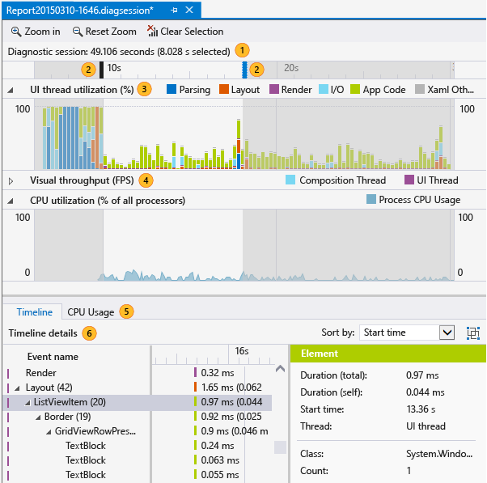
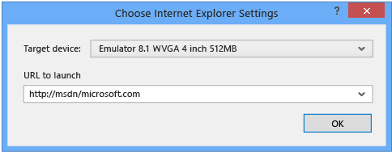

# Running Profiling Tools With or Without the Debugger
Visual Studio now offers you a choice of performance tools, some of which (for example, **CPU Usage** and **Memory Usage**) can be run with or without the debugger. Non-debugger performance tools are intended to run on Release configurations, while debugger-integrated tools are intended to run on Debug configurations.  
  
## Should I run the tool with or without the debugger?  
 Debugger-integrated performance tools let you do a lot of things non-debugger tools cannot, for example set breakpoints and inspect variable values. Non-debugger tools give you an experience that is closer to what users of the released application will see.  
  
 Here are some questions that can help you decide which kind of tool is right for your purposes:  
  
1.  Was the issue found while the application was being developed, or was it found in a released version?  
  
     If the issue you are dealing with was found during development, you probably don’t need to run the performance tools in a Release build. If it was found in a Release version, you should reproduce the issue with a Release configuration, and then decide whether or not the debugger would help for further investigation.  
  
2.  Is the issue caused by CPU-intensive processing?  
  
     Many problems are due to external performance issues such as file I/O or network responsiveness, so it shouldn’t make much difference whether you run the performance tools with or without the debugger. If your issue is due to CPU-intensive calls, the difference between Release and Debug configurations may be considerable, and you should probably check to see if the issue exists in the Release build before using the debugger-integrated tools  
  
3.  Do you need to measure performance precisely, or is an approximate number acceptable?  
  
     Debug builds lack certain optimizations that Release builds provide, for example inlining function calls and constants, pruning unused code paths, and storing variables in ways that can’t be used by the debugger. The debugger itself changes performance times because it performs certain operations that are necessary for debugging (for example, intercepting exception and module load events). So performance numbers in the debugger-integrated tools are accurate only to within tens of milliseconds. Performance numbers for Release configurations with the non-debugger tools are much more precise.  
  
##   Collect profiling data while debugging  
 The following section deals with debugging locally. You can find out about debugging on a device or remote debugging, in later sections.  
  
1.  Open the project you want to debug, then click **Debug / Start Debugging** (or **Start** on the toolbar, or **F5**).  
  
2.  The **Diagnostic Tools** window appears automatically unless you have turned it off. To bring up the window again, click **Debug / Windows / Show Diagnostic Tools**.  
  
3.  Run the scenarios that you want to collect data for.  
  
     While you are running the session, you can see information about events, process memory, and CPU utilization.  
  
     The following graphic shows the **Diagnostic Tools** window in Visual Studio 2015 Update 1:  
  
       
  
4.  You can choose whether to see **Memory Usage** or **CPU Usage** (or both) with the **Select Tools** setting on the toolbar. If you are running Visual Studio Enterprise,  you can enable or disable IntelliTrace in **Tools / Options / IntelliTrace**.  
  
5.  The diagnostic session ends when you stop debugging.  
  
 In Visual Studio 2015 Update 1, the **Diagnostic Tools** window makes it easier for you focus on the events you are interested in.   The event names are now shown with category prefixes (**Gesture**, **Program Output**, **Breakpoint**, **File,** etc.) so you can quickly scan the list for a given category or skip the categories you don't care about.  
  
 The window now has a search box so that you can find a specific string anywhere in the event list. For example, the following graphic shows the results of a search for the string "install" that matched four events:  
  
   
  
 You can also filter events in and out of view in the window. In the **Filter** dropdown, you can check or uncheck specific categories of events:. The category names are the same as the prefix names.  
  
   
  
 For more information, see [Searching and filtering the Events tab of the Diagnostic Tools window](http://blogs.msdn.com/b/visualstudioalm/archive/2015/11/12/searching-and-filtering-the-events-tab-of-the-diagnostic-tools-window.aspx).  
  
## Collect profiling data without debugging  
 Some profiling tools require administrator privileges to run. You can start Visual Studio as an administrator, or you can choose to run the tools as an administrator when you start the diagnostic session.  
  
1.  Open the project in Visual Studio.  
  
2.  On the **Debug** menu, choose **Performance Profiler...** (Shortcut key: Alt + F2).  
  
3.  On the diagnostic launch page, choose one or more tools to run in the session. Only the tools that are applicable to the project type, operating system, and programming language are displayed. When you choose a diagnostic tool, the selections for tools that cannot be run in the same diagnostic session are disabled. Here's how your choices might look for a C# Windows Universal app:  
  
       
  
4.  To start the diagnostic session, click **Start**.  
  
5.  Run the scenarios for which you want to collect data.  
  
     While you are running the session, some tools display graphs of real-time data on the diagnostic tools launch page.  
  
       
  
6.  To end the diagnostic session, click **Stop collection**.  
  
 When you stop collecting data in a diagnostic session, the data is analyzed and the report is displayed in the Diagnostic page.  
  
 You can also open saved .diagnostic session files from the recently opened list on the diagnostic tools launch page.  
  
   
  
## The profiling report  
   
  
|||  
|-|-|  
||The timeline shows the length of the profiling session, app lifecycle activation events, and user marks.|  
||You can restrict the report to a part of the timeline by dragging the blue bars to select a region of the timeline.|  
||A tool displays one or more master graphs. If your diagnostic session is created with multiple tools, all of the master graphs are displayed.|  
||You can collapse and expand the individual graphs.|  
||When your data includes information from multiple tools, the details for the tool is collected under tabs.|  
||A tool can have one or more detail views. The view is filtered by the selected region of the timeline.|  
  
## Setting the analysis target to another device  
 Besides starting your app from the Visual Studio project, you can also run diagnostic sessions on alternative targets. For example, you might want to diagnose performance issues on a version of your app that was installed from the Windows App Store.  
  
   
  
 You can start apps that are already installed on a device, or you can attach the diagnostic tools to some apps that are already running. When you choose **Running App** or **Installed App**, you select the app from a list that discovers the apps on the specified deployment target.  
  
   
  
 When you choose **Internet Explorer**, you specify the URL and you can change the phone deployment target.  
  
   
  
## Remote Debugging  
 Running a diagnostic session on a remote PC or tablet requires that the Visual Studio Remote Tools be installed and running on the remote target. For desktop apps, see [Remote Debugging](../debugger/remote-debugging.md).  For Windows Universal apps, see [Run Windows Store apps on a remote machine](../debugger/run-windows-store-apps-on-a-remote-machine.md).  
  
## Blog posts and MSDN articles from the Diagnostics development team  
 [MSDN Magazine: Analyze Performance While Debugging in Visual Studio 2015](https://msdn.microsoft.com/en-us/magazine/dn973013.aspx)  
  
 [MSDN Magazine: Use IntelliTrace to Diagnose Issues Faster](https://msdn.microsoft.com/en-us/magazine/dn973014.aspx)  
  
 [Blog post: Diagnosing Event Handler Leaks with the Memory Usage Tool in Visual Studio 2015](http://blogs.msdn.com/b/visualstudioalm/archive/2015/04/29/diagnosing-event-handler-leaks-with-the-memory-usage-tool-in-visual-studio-2015.aspx)  
  
 [Video: Historical Debugging with IntelliTrace in Microsoft Visual Studio Ultimate 2015](https://channel9.msdn.com/Events/Ignite/2015/BRK3716)  
  
 [Video: Debugging Performance Issues Using Visual Studio 2015](https://channel9.msdn.com/Events/Build/2015/3-731)  
  
 [PerfTips: Performance Information at-a-glance while Debugging with Visual Studio](http://blogs.msdn.com/b/visualstudioalm/archive/2014/08/18/perftips-performance-information-at-a-glance-while-debugging-with-visual-studio.aspx)  
  
 [Diagnostic Tools debugger window in Visual Studio 2015](http://blogs.msdn.com/b/visualstudioalm/archive/2015/01/16/diagnostic-tools-debugger-window-in-visual-studio-2015.aspx)  
  
 [IntelliTrace in Visual Studio Enterprise 2015](http://blogs.msdn.com/b/visualstudioalm/archive/2015/01/16/intellitrace-in-visual-studio-ultimate-2015.aspx)